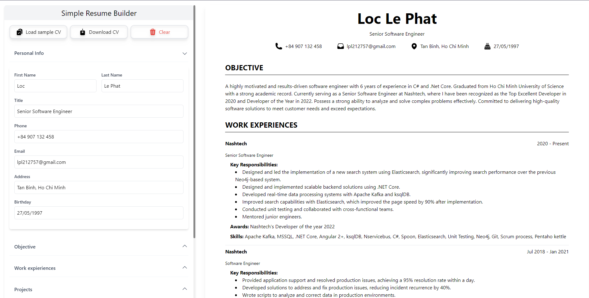

# SimpleResume: The Simple Resume Builder Application

[](LICENSE)
[](https://github.com/locle97/SimpleResume/stargazers)
[](https://github.com/locle97/SimpleResume/network)

## Introduction

Welcome to **SimpleResume**, a simple and efficient resume builder application designed to help you create professional resumes effortlessly. Whether you need a simple resume, a minimal CV, or simple resume examples, SimpleResume has you covered.

## Live Demo

Check out our live demo to see SimpleResume in action: https://simpleresume.net/builder



## Features

- **User-Friendly Interface**: Easy to navigate and use, even for beginners.
- **Real-Time Preview**: See your changes in real-time.
- **Export Options**: Download your resume in PDF format.
- **Responsive Design**: Accessible on both desktop and mobile devices.

## Getting Started

### Prerequisites

Ensure you have the following installed:

- [Node.js](https://nodejs.org/)
- [npm](https://www.npmjs.com/)

### Installation

1. Clone the repository:
    ```bash
    git clone https://github.com/locle97/SimpleResume.git
    cd SimpleResume
    ```

2. Install dependencies:
    ```bash
    npm install
    ```

3. Run the application:
    ```bash
    npm run dev
    ```

4. Open your browser and navigate to `http://localhost:5173` to see the application in action.

## Contributing

We welcome contributions to improve SimpleResume! Please follow these steps:

1. Fork the repository.
2. Create a new branch: `git checkout -b feature-name`
3. Commit your changes: `git commit -m 'Add new feature'`
4. Push to the branch: `git push origin feature-name`
5. Open a pull request.

## License

This project is licensed under the MIT License - see the [LICENSE](LICENSE) file for details.

## Acknowledgements

- [Node.js](https://nodejs.org/)
- [npm](https://www.npmjs.com/)
- [Tailwind CSS](https://tailwindcss.com/)

## Contact

For any inquiries or issues, please contact [Loc Le](mailto:lpl212757@gmail.com).

---

*Keywords: Simple Resume, Simple Resume Format, Simple Resume Examples, Minimal Resume, Minimal CV, Resume Builder, CV Builder, Professional Resume, Resume Templates*

